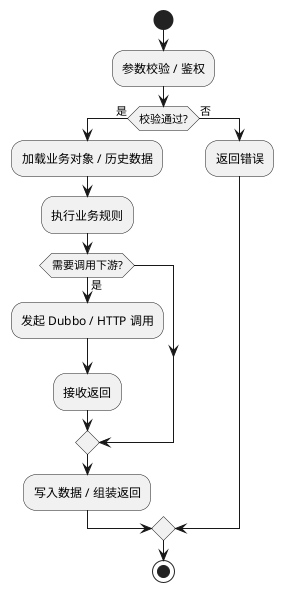

# 接口明细模板

<!-- GGG_INTERFACE_SCHEMA_VERSION: 3 -->

> 用途：用于单接口详细设计。一个接口一个文档，重点回答“这个接口怎么调、关键链路怎么走、依赖谁、读写什么、失败怎么处理”。

> 前提：如果关联对象、表结构、状态流转还没定清，不要先写这个文档。

## 1. 基本信息

| 项 | 内容 |
|---|---|
| 设计ID |  |
| 来源Cxx |  |
| 契约名称 |  |
| 新增 / 修改 |  |
| 所属项目 |  |
| 契约类型 | HTTP / RPC / MQ / Job / 内部方法 |
| 契约标识 |  |
| 调用方 / 触发事件 |  |
| 处理入口 |  |
| 关联表 / 关键对象 |  |
| 关键依赖 |  |
| 说明 |  |

## 2. 契约与参数

### 2.1 请求参数表

> 无请求体或无业务参数时，保留一行并在字段列写“`不涉及：具体原因`”。

| 字段 | 位置 | 类型 | 必填 | 示例值 | 来源 | 是否后端推导 | 外部是否允许传 | 说明 |
|---|---|---|---|---|---|---|---|---|
|  | Path / Query / Body / Header / Message / Context |  | 是 / 否 |  | 外部 / 上游 / 登录态 / 系统补充 | 是 / 否 | 是 / 否 |  |

### 2.2 响应参数表

> 无响应体时，保留一行并在字段列写“`不涉及：具体原因`”。

| 字段 | 类型 | 说明 |
|---|---|---|
| code | int | 业务状态码 |
| msg | string | 提示信息 |
| data | object | 响应主体 |
| data.xxx |  |  |

### 2.3 请求 JSON 示例

```json
{
  "fieldA": "value",
  "fieldB": 1
}
```

### 2.4 响应 JSON 示例

```json
{
  "code": 200,
  "msg": "success",
  "data": {
    "fieldA": "value"
  }
}
```

### 2.5 参数校验与兼容规则

- 参数校验：
- 关键业务规则：
- 兼容旧契约：
- 输出副作用：

## 3. 处理链路

### 3.1 核心处理步骤

1. 参数校验、鉴权、幂等判断。
2. 加载运行时对象、历史数据或上游返回。
3. 执行业务规则、状态流转和数据组装。
4. 调用关键下游依赖并完成数据读写。
5. 组装返回。

### 3.2 关键依赖与数据落点

| 类型 | 名称 | 用途 | 关键输入 / 输出 | 说明 |
|---|---|---|---|---|
| 内部服务 / Dubbo / HTTP / Mapper / 表 |  |  |  |  |

### 3.3 接口流程图



### 3.4 异常与失败处理

| 场景 | 错误码 / 返回 | 调用方感知 | 处理方式 |
|---|---|---|---|
| 参数缺失或格式非法 |  |  |  |
| 业务校验失败 |  |  |  |
| 依赖服务超时 / 异常 |  |  |  |
| 数据读写失败 |  |  |  |

### 3.5 接口时序图（仅链路复杂时）

- 本接口是否需要补时序图：
- 如果需要，补充原因：

## 4. 测试链路

| 链路 / 场景 | 关注点 | 验证方式 | 说明 |
|---|---|---|---|
| 主流程 |  | 单测 / 接口 / 联调 |  |
| 关键异常 |  | 单测 / 接口 / 联调 |  |
| 数据验证 |  | SQL / 接口 / 回归 |  |
