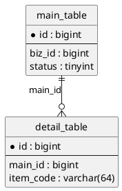

# 技术方案模板

> 用途：给开发、评审、联调用的主设计文档。写清"实例身份怎么定、接口契约怎么协作、数据放哪里、改哪里、怎么验证"。

> 默认顺序：身份与契约骨架先行，数据承载随后，最后写完整方案。

> 证据追溯：会影响实现的设计必须引用 `01-research.md` 的 `Cxx` 结论；设计决策使用 `D1/D2/...` 编号，下游任务用 `Dxx/Cxx/interface/schema` 追溯来源。

> 版本：4.0.0 | 日期：YYYY-MM-DD | 作者： | 状态：草稿

## 一、背景与目标

- 需求背景：
- 一句话目标：
- 本期包含：
- 本期不做：
- 依赖方与协作方：

## 二、实例身份与状态隔离

> 先回答"这条业务记录唯一由什么标识"，再设计存储和接口。

### 2.1 实例身份表

| 业务对象/记录 | 唯一标识 | 状态隔离维度 | 去重维度 | 生命周期 | 来源证据 | 是否已确认 |
|---|---|---|---|---|---|---|
|  |  |  |  |  |  | 是/否 |

### 2.2 后端自动推导与前端禁止传

| 字段/身份 | 后端获取方式 | 前端是否允许传 | 禁止原因 | 兜底/校验方式 |
|---|---|---|---|---|
|  |  | 是/否 |  |  |

## 三、前后端接口协作流

> 只写页面动作到后端契约，不写前端实现细节。

| 页面/动作 | 调用接口 | 首屏/点击后 | 请求关键字段 | 后端自动推导 | 前端禁止传 | 返回粒度 | 说明 |
|---|---|---|---|---|---|---|---|
|  |  | 首屏/点击后/提交后 |  |  |  |  |  |

## 四、数据承载设计

> 所有存储层一起考虑，不只 SQL。

| 数据/状态 | 承载方式 | MySQL | Redis | ES | MQ | 配置/缓存 | 选择原因 | 一致性/过期策略 |
|---|---|---|---|---|---|---|---|---|
|  |  | 是/否 | 是/否 | 是/否 | 是/否 | 是/否 |  |  |

## 五、SQL 表设计

> 如无 MySQL 结构变更，写明"无 MySQL 结构变更"及原因，不创建 `04-schema.sql`。

### 5.1 SQL 字段风格参考

| 参考项目/模块 | 参考表 | 公共字段风格 | 逻辑删除字段 | 时间字段 | 用户字段口径 | 索引命名风格 | 说明 |
|---|---|---|---|---|---|---|---|
|  |  | `id/create_user/create_time/modify_user/modify_time/is_delete` |  |  |  |  |  |

### 5.2 `user_id` 设计判断

| 是否需要 `user_id` | 用户语义 | 身份来源 | 是否前端可传 | 是否后端推导 | 是否参与唯一键/索引 | 与实例身份关系 | 说明 |
|---|---|---|---|---|---|---|---|
| 是/否 | 学生/老师/操作者/创建人 |  | 是/否 | 是/否 |  |  |  |

### 5.3 SQL 瘦身检查

#### 表准入

| 表 | 业务事实 | 写入事件 | 查询场景 | 生命周期 | 能否复用旧表 | 不建表后果 |
|---|---|---|---|---|---|---|
|  |  |  |  |  | 是/否 |  |

#### 字段准入

| 表 | 字段 | 来源 | 写入时机 | 读取场景 | 是否可推导 | 是否参与查询/唯一键/索引 | 不落库后果 |
|---|---|---|---|---|---|---|---|
|  |  |  |  |  | 是/否 |  |  |

### 5.4 表结构概览

| 设计ID | 表名 | 定位 | 新增/修改 | 关键字段 | 主键/唯一键 | 索引 | 来源Cxx | 说明 |
|---|---|---|---|---|---|---|---|---|
|  |  | 主表/明细表/关系表 | 新增/修改 |  |  |  |  |  |

### 5.5 字段设计（新增表或关键改表时）

| 设计ID | 表 | 字段 | 类型 | 必填 | 默认值 | 含义 | 来源Cxx | 备注 |
|---|---|---|---|---|---|---|---|---|
|  |  |  |  | 是/否 |  |  |  |  |

### 5.6 ER 图（仅新增表时）

- 历史数据处理：
- 涉及 MySQL 变更时详见 `04-schema.sql`

## 六、核心改动

### 6.1 改动清单

| 设计ID | 项目 | 类型 | 类/文件/表 | 改动类型 | 来源Cxx | 改动说明 |
|---|---|---|---|---|---|---|
|  |  | Controller/Service/Facade/DTO/Mapper/SQL |  | 新增/修改 |  |  |

### 6.2 旧逻辑与新逻辑差异

| 维度 | 旧逻辑 | 新逻辑 | 改动原因 |
|---|---|---|---|
|  |  |  |  |

## 七、主链路与依赖

### 7.1 核心调用链

| 调用方 | 被调方 | 接口/方法 | 用途 | 说明 |
|---|---|---|---|---|
|  |  |  |  |  |

### 7.2 事务与异常处理

- 事务边界：
- 幂等策略：
- 关键异常处理：

### 7.3 主时序图

## 八、接口设计

> 主文档只保留接口总表，每个接口的详细设计拆到 `interface-details/`。

### 接口总表

| 设计ID | 接口名称 | 新增/修改 | 请求方式 | 路径/方法 | 所属项目 | 首屏/点击后/提交后 | 接口文档地址 | 来源Cxx | 备注 |
|---|---|---|---|---|---|---|---|---|---|
|  |  |  |  |  |  |  | `interface-details/02-interface-01-xxx.md` |  |  |

## 九、枚举、状态与常量

| 名称 | 所属项目/类 | 类型 | 取值 | 用途 | 新增/修改 |
|---|---|---|---|---|---|
|  |  | Enum/Constant/Status |  |  |  |

## 十、缓存设计（按需）

> 不涉及缓存可删除本章节，但数据承载设计中必须说明不涉及原因。

- 缓存类型：本地缓存 / Redis / 多级缓存
- 缓存 Key 设计：
- 过期策略：
- 缓存更新策略：Cache-Aside / Write-Through / Write-Behind
- 缓存穿透/击穿/雪崩防护：
- 数据一致性保障：

## 十一、消息队列设计（按需）

> 不涉及 MQ 可删除本章节，但数据承载设计中必须说明不涉及原因。

| Topic | 生产方 | 消费方 | 消息体 | 消费幂等策略 | 重试策略 | 说明 |
|---|---|---|---|---|---|---|
|  |  |  |  |  |  |  |

- 消息顺序性要求：
- 消费失败处理：
- 死信队列：

## 十二、配置变更

> 不涉及配置变更可删除本章节，但数据承载设计中必须说明不涉及原因。

| 配置项 | 所属项目 | 配置文件 | 旧值 | 新值 | 说明 |
|---|---|---|---|---|---|
|  |  |  |  |  |  |

- 是否需要动态配置（Nacos/Apollo）：
- 配置变更是否需要重启：

## 十三、设计决策记录

| 设计ID | 决策点 | 选择 | 不选方案 | 来源Cxx | 原因 | 影响 |
|---|---|---|---|---|---|---|
|  |  |  |  |  |  |  |

## 十四、影响范围

- 影响的项目：
- 影响的接口：
- 影响的表：
- 是否需要联调：
- 兼容性注意：

## 十五、发布与灰度策略

- 发布顺序：
- 灰度策略：全量 / 按比例 / 按用户 / 按租户
- 数据迁移/刷数：
- 回滚方案：
- 发布前检查清单：

## 十六、测试链路与风险

### 测试链路

| 场景 | 关注点 | 验证方式 | 说明 |
|---|---|---|---|
| 主流程 |  |  |  |
| 关键异常 |  |  |  |
| 数据验证 |  |  |  |
| 缓存场景 |  |  |  |
| MQ 场景 |  |  |  |

### 关键风险

| 风险点 | 影响 | 规避动作 | 是否阻塞任务拆分 |
|---|---|---|---|
|  |  |  | 是/否 |
